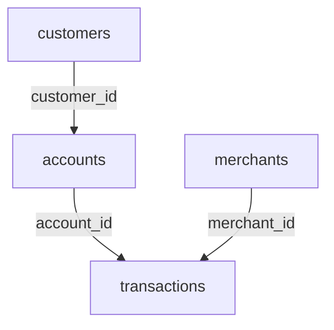

# Project Design

## 1) Overview

Transaction intelligence is a learning focused data analysis project built with Python, Numpy and pandas

The project analyses financial transaction data to study customer behaviour, identify data quality problems and detect unusual transactions

The complete workflow will include:
- Data inspection
- Data cleaning
- Data transformation
- Integration of multiple tables
- Customer behaviour analysis
- Time based analysis
- Statistical anomaly detection
- Performance optimisation
- Final reporting

## 2) Project entities

The project will initially contain four main entities:
1. Customers
2. Accounts
3. Merchants
4. Transactions

Each entity will be stored in a different csv file

```text
customers.csv
accounts.csv
merchants.csv
transactions.csv
```

## 3) Relationship between tables

The tables are related in the following way:



The relationships are:
- One customer can have one or more accounts
- Each account belongs to one customers
- One account can contain many transactions
- Each transaction belongs to one account
- One merchant can receive many transactions
- Each transaction is associated with one merchant

## 4) Customers table

The customers table stores general information about each customer

| Column | Desctiption | Expected type | Example |
| --- | --- | --- | --- |
| `customer_id` | Unique customer identifier | string | `C001` |
| `age` | Customer age | integer | `32` |
| `country` | Country of residence | string | `Spain` |
| `signup_date` | Date when the customer joined | date | `2024-03-15` |
| `customer_segment` | Commercial customer segment | category | `Standard` | 

### Primary key

The primary key is:

```text
account_id
```

### Foreign key
```text
customer_id
```

It connects each account with a row in `customers.csv`

## 5) Accounts table

The accounts table stores the financial accounts owned by customers

| Column | Description | Expected type | Example |
|---|---|---|---|
| `account_id` | Unique account identifier | string | `A001` |
| `customer_id` | Identifier of the account owner | string | `C001` |
| `account_type` | Type of financial account | category | `Current` |
| `currency` | Main currency of the account | category | `EUR` |
| `opening_date` | Date when the account was opened | date | `2024-03-16` |
| `status` | Current account status | category | `Active` |

### Primary key

The primary key is:

```text
account_id
```

### Foreign key

The foreign key is:

```text
customer_id
```

It connects each account with a row in `customers.csv`

## 6) Merchants table

The merchants table stores information about the businesses receiving transactions

| Column | Description | Expected type | Example |
|---|---|---|---|
| `merchant_id` | Unique merchant identifier | string | `M001` |
| `merchant_name` | Merchant name | string | `Green Market` |
| `category` | Merchant business category | category | `Groceries` |
| `country` | Country where the merchant is located | string | `Spain` |
| `online` | Whether the merchant operates online | boolean | `False` |

### Primary key

The primary key is:

```text
merchant_id
```

Each merchant must have a unique `merchant_id`.

## 7) Transactions table

The transactions table stores individual financial operations

| Column | Description | Expected type | Example |
|---|---|---|---|
| `transaction_id` | Unique transaction identifier | string | `T0001` |
| `account_id` | Account used for the transaction | string | `A001` |
| `merchant_id` | Merchant receiving the transaction | string | `M001` |
| `timestamp` | Date and time of the transaction | datetime | `2025-01-15 18:42:00` |
| `amount` | Transaction amount | float | `42.75` |
| `currency` | Currency used in the transaction | category | `EUR` |
| `transaction_type` | Type of transaction | category | `Purchase` |
| `status` | Transaction status | category | `Completed` |

### Primary key

The primary key is:

```text
transaction_id
```

### Foreign keys

The foreign keys are:

```text
account_id
merchant_id
```

They connect each transaction with an account and a merchant

## 8) Initial business questions

The project will attempt to answer questions such as:

1. How much does this customer spend?
2. What is the average transaction amount?
3. Which merchant categories receive the most money?
4. Which customers make the most transactions?
5. What percentage of transactions are international?
6. How does transaction activity change over time?
7. Which transactions are unusual compared with the customer's normal behaviour?
8. Which customers suddenly increase their spending?
9. Which merchants receive an unusually high number of transactions?
10. How would different financial scenarios affect revenue?

## 9) Basic data rules

- Every primary key must be unique
- Every account must belong to an existing customer
- Every transaction must belong to an existing account
- Every transaction must reference an existing merchant
- Transaction amounts must normally be greater than zero
- Customer ages must be within a realistic range
- Dates must use a consistent format
- Currency codes should use three uppercase letters
- Categorical values should use consistent spelling
- Completed transactions should contain a valid amount and timestamp

## 10) Planned data quality problems

Later versions of the dataset will intentionally contain errors suuch as:

- Missing values
- Duplicate rows
- Duplicate identifiers
- Invalid dates
- Amounts stored as text
- Negative amounts
- Inconsistent category names
- Lowercase currency codes
- Accounts linked to nonexistent customers
- Transactions linked to nonexistent merchants
- Unrealistic customer ages
- Unexpected transaction statuses

These errors will be used to practise data inspection, validation and cleaning with pandas

## 11) Initial development strategy

The project will be developed progressively:

1. Create a small manually written dataset
2. Inspect the data with pandas
3. Introduce and identify data quality problems
4. Clean and validate the data
5. Join the different tables
6. Analyse customer and merchan behaviour
7. Generate larger synthetic datasets with numpy
8. Develop time based features
9. Implement statistical anomaly detection
10. Optimise and test the final pipeline


